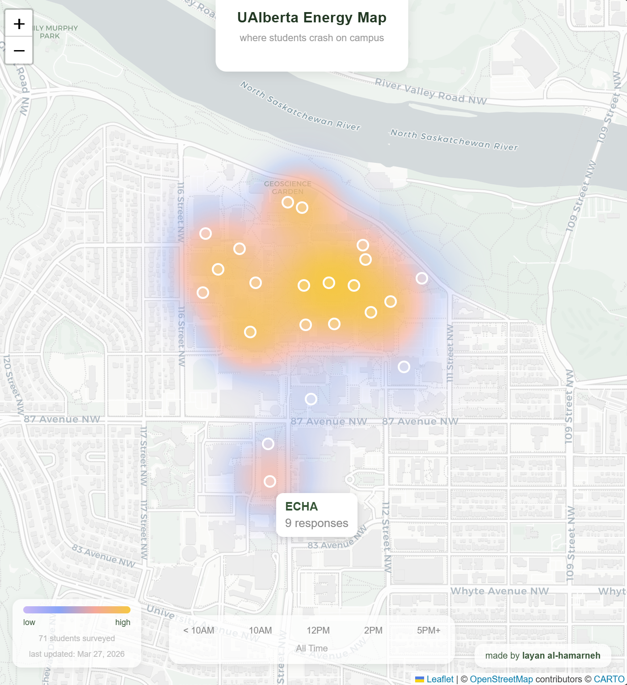
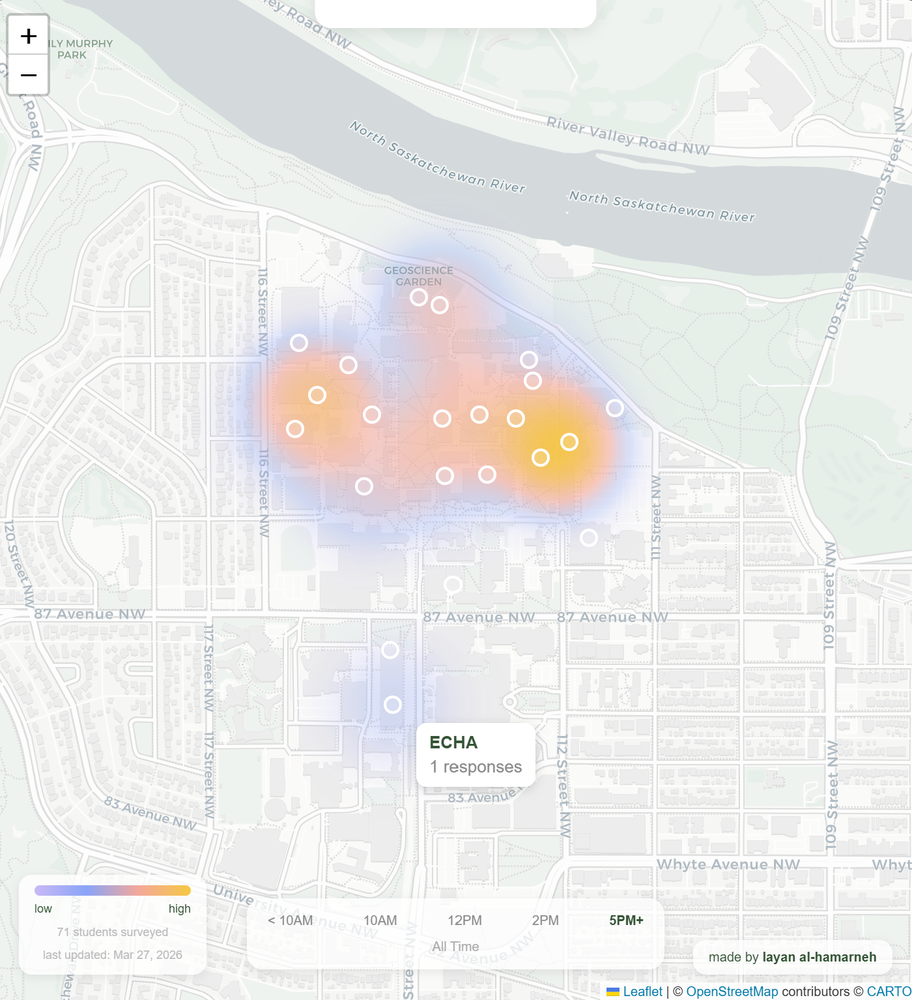

# UAlberta-Energy-Heatmap
A visualized heatmap of where (and when) UAlberta students crash the hardest on campus.

## How it works
Survey responses are collected via Google Forms and pulled live into a Python script.
Building names are parsed, matched, and geocoded automatically.
Response counts per building are visualized as a heatmap overlay on an interactive map of campus.
The timeline at the bottom lets you filter by time of day to see how crash patterns shift throughout the day.

## Stack
- Python, Pandas, Folium
- Nominatim for geocoding
- RapidFuzz for fuzzy building name matching
- Google Forms + Sheets as the data source

## Data
Over 71 UAlberta student responses. Ethics cleared by UAlberta REB under TCPS2 (2022).

## Screenshots

<em>All time view.</em>

<em>Later than 5 PM crash window.</em>
